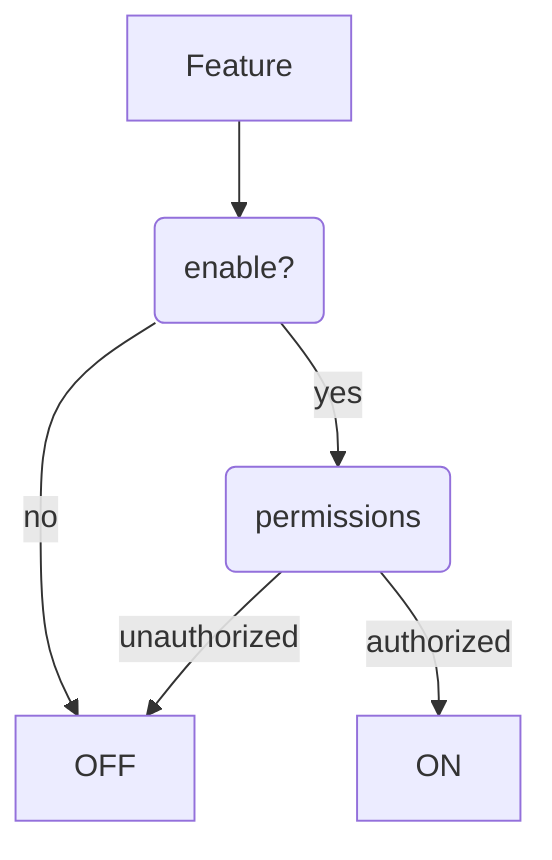

This is the start of my content and this will be shown as the excerpt.

---

[[toc]]

## Second

### third

Eu consectetur laborum officia ullamco consequat aute aliqua sit aute sunt proident aliquip adipisicing quis. Minim ex consequat duis exercitation sunt ea. Ipsum qui dolor incididunt cillum consequat exercitation dolore nisi tempor. Velit ipsum ad amet proident cillum dolor aliqua. Aliqua mollit occaecat labore irure. Nostrud exercitation dolor fugiat nostrud laboris labore aliquip et incididunt consequat incididunt proident nisi dolor. Pariatur dolore ea proident ad esse eu ipsum.

Irure ipsum cillum nulla nostrud occaecat enim laboris duis. Mollit ex elit duis Lorem veniam nulla enim. Cillum irure anim in non elit dolore adipisicing Lorem aliqua velit voluptate ea. Deserunt ex amet aute eiusmod. Qui ut do esse duis qui nostrud in.

`Occaecat` mollit aliquip id aliqua id mollit magna aliquip consectetur laboris non commodo ipsum et. Sint sit aliquip laborum eu Lorem nisi magna esse anim non. Elit sint eiusmod cillum ad. Qui ad adipisicing ut quis consectetur ut voluptate tempor. Exercitation labore elit sit magna velit dolor adipisicing voluptate minim fugiat excepteur commodo nostrud minim. Labore mollit ea ex nostrud culpa laboris tempor exercitation est amet.

Deserunt consequat irure eiusmod nostrud non exercitation duis irure occaecat fugiat commodo. Qui esse minim aliqua qui sunt amet culpa aute quis magna fugiat aliquip. Officia commodo anim aliqua id Lorem velit fugiat sit minim.

Fugiat aliqua consectetur sint anim elit aliquip occaecat incididunt ea minim deserunt cupidatat est. Aute quis id incididunt ex aliqua nisi. Commodo dolor est in eu ullamco id duis commodo. Voluptate officia velit velit elit ex voluptate consectetur minim nulla. Non non dolore aliqua id fugiat.

Enim irure ipsum fugiat fugiat Lorem nulla. Fugiat culpa est magna pariatur do exercitation ut culpa adipisicing minim ipsum aute non. Id velit duis sint consectetur ut in officia voluptate cupidatat ut culpa laboris officia. Nulla amet tempor in elit commodo cillum deserunt ullamco.

Anim excepteur irure qui est enim exercitation Lorem incididunt esse et Lorem ut sint amet. Deserunt anim qui nulla est velit aute anim. Sint laborum aliquip consectetur in voluptate dolore ex. Ad deserunt in elit anim. Elit deserunt deserunt cupidatat sit sunt. Aliqua excepteur nostrud et nisi culpa aute voluptate dolore est deserunt consectetur reprehenderit non. Aliquip sint consequat proident Lorem dolore non.

Test of markdown capabilities. [^markdown-capabilities]

- unordered **list**
  - nested _item_

## Second level heading

> blockquote

~~Not a sentence~~

You should search [here](https://duckduckgo.com).

JavaScript (check line `number 2`)

```js/1
function foo() {
  return `bar`
}
```

<button class="run">Run</button>

<script>
  function insertAfter(newNode, referenceNode) {
      referenceNode.parentNode.insertBefore(newNode, referenceNode.nextSibling);
  }
  const button = document.querySelector('.run')
  button.addEventListener('click', async () => {
    const code = Array.from(button.parentElement.previousElementSibling.querySelectorAll('.highlight-line')).map(lineElement => lineElement.textContent).join("\n")
    console.log(code)
    console.log(eval(code))
    const first = await import('./first.js');
    const result = first.default()
    const pre = document.createElement('pre')
    pre.innerHTML = `<div>Result:</div><code>${result}</code>`
    insertAfter(pre, button)
  })
</script>

and see the difference

```js/2/1
;(function foo() {
  return `bar`
  return `baz`
})()
```

```js
;(function foo() {
  return `bar`
  return `baz`
})()
```

Run this

```js {run}
;(function foo() {
  return `bar`
  return `baz`
})()
```

Shell session

```shell-session
sudo apt update
sudo apt full-upgrade
```

Typescript

```typescript
// Regex "y" and "u" flags
var a = /[a-zA-Z]+/gimyu;

// for..of loops
for(let x of y) { }

// Modules: import
import { foo as bar } from "file.js"

// Template strings
`Only on ${y} one line`
`This template string ${x} is on

multiple lines.`
`40 + 2 = ${ 40 + 2 }`
`The squares of the first 3 natural integers are ${[for (x of [1,2,3]) x*x].join(', ')}`

// this is it
@Foo()
function foo(): null {
  const array = [...new Set()]
  const num = 5
  const str = 'abc'
  const bool = true
  const rege = /abc/g;
  EOO: for (let index = 0; index < array.length; index++) {
    const element = array[index];
  }
  return null;
}
```

```typescript {run}
// Regex "y" and "u" flags
var a = /[a-zA-Z]+/gimyu;

// for..of loops
for(let x of y) { }

// Modules: import
import { foo as bar } from "file.js"

// Template strings
`Only on ${y} one line`
`This template string ${x} is on

multiple lines.`
`40 + 2 = ${ 40 + 2 }`
`The squares of the first 3 natural integers are ${[for (x of [1,2,3]) x*x].join(', ')}`

// this is it
@Foo()
function foo(): null {
  const array = [...new Set()]
  const num = 5
  const str = 'abc'
  const bool = true
  const rege = /abc/g;
  EOO: for (let index = 0; index < array.length; index++) {
    const element = array[index];
  }
  return null;
}
```

HTML

```html
<strong class="foo">&amp;</strong>
```

CSS

```css [This is css]
:root {
  --some: red;
}

.foo {
  font-size: 1.2rem;
  color: var(--red);
  grid-template-rows: 'header';
}
```

<details>
<summary>Hidden content</summary>
You found it!
</details>

HTML ^[[html's homepage](https://www.w3.org/html/)] is a great language?!

## Paragraphs

Block of paragraph
on multiple lines
separated only by newlines
and not empty lines.

<div id="a">a</div>

"Typography" -- it's fantastic!

[^markdown-capabilities]: [markdown capabilities](https://github.com/markdown-it/markdown-it#syntax-extensions)

\*[HTML]: Hyper Text Markup Language

## Image


## Interactive code examples

```js
let x = [1, 2, 3]
let y = x.reduce((sum, number) => {
  return sum + number
}, 0)
console.log(y)
```

<pre>
  <code class="klipse-eval-js language-js"
  data-external-libs="https://unpkg.com/hyperhtml@2.31.6/min.js"
  >
    const a = hyperHTML.wire()`<p>text</p>`
    a
  </code>
</pre>

<div id="foo" class="foo"></div>

<script>
document.getElementById('a').textContent = 'Changed by JavaScript'
</script>

## Mermaid



## Embed

<iframe
  height="400px"
  width="100%"
  src="https://repl.it/repls/OrangeredHospitableKernelmode?lite=true"
  scrolling="no"
  frameborder="no"
  allowtransparency="true"
  allowfullscreen="true"
  sandbox="allow-forms allow-pointer-lock allow-popups allow-same-origin allow-scripts allow-modals"
></iframe>
