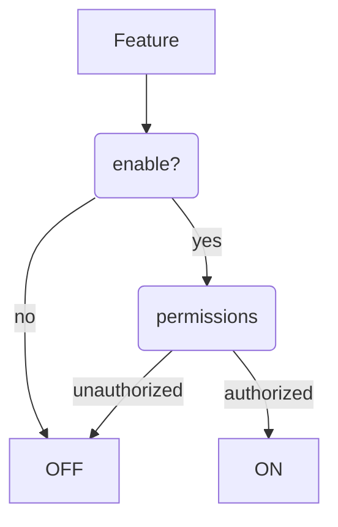

Let's try what markdown offers in context of Eleventy static site generator.

---

Markdown in Eleventy is parsed by [markdown-it](https://github.com/markdown-it/markdown-it). It can be extended by a number of [plugins](https://www.npmjs.com/search?q=keywords:markdown-it-plugin).

The first example is a table of content---it is a list that consists of headings on level 2. The plugin for this is [`markdown-it-table-of-contents`](https://www.npmjs.com/package/markdown-it-table-of-contents).

[[toc]]

## This is a heading h2

### This is a heading h3

#### This is a heading h4

##### This is a heading h5

## Text

Paragraphs in markdown have to be divided by a blank line.

This paragraph contains
multiple lines in source code,
because I like it more this way.
I've set it by a configuration option:

```
breaks: true
```

_(Code block without specified language.)_

### Text elements

**bold** _italic_ ~~strikethrough~~ `code`

> Quote

```js
const foo = 'more code'
```

_(Code block with language specified as `js`.)_

### Lists

- First
  - Alpha
  - Beta
- Second

1. First
   - Alpha
   - Beta
2. Second

### Automatic conversions

Links like example.com are automatically converted.

You can use two hyphens to produce an n-dash, e.g. 9--12. Or three hyphens---to create [m-dash](https://www.thepunctuationguide.com/em-dash.html).

"Quotation marks" and ellipsis is supported too...

## Extras

Extra markdown functionality is provided either by embedded or external `markdown-it` plugins.

### Tables

| Memory      | Latency (ns) |
| ----------- | ------------ |
| L1 cache    | 0.5          |
| L2 cache    | 7            |
| Main memory | 100          |

Source: [Latency Numbers Every Programmer Should Know](https://gist.github.com/jboner/2841832)

### Footnotes

You can specify references to footnotes by writing something like this
inside markdown: [^markdown-capabilities]

```text
[^markdown -capabilities]
```

And somewhere after that:

```text
[^markdown-capabilities]: [markdown capabilities](https://github.com/markdown-it/markdown-it#syntax-extensions)
```

[^markdown-capabilities]: [markdown capabilities](https://github.com/markdown-it/markdown-it#syntax-extensions)

### Anchors

Hover over a heading, click the `#` sign and use targeted url...

### Figures

Look, this is a `<figure>` with caption.

<div class="hide-white-background">


</div>

## My custom plugins

You can write your own plugin for `markdown-it`---it is one function.

### Code blocks with title

This line

````text
```html [Elaborate html document]
...html code...
````

produces

```html [Elaborate html document]
<html>
  <body>
    <h1>Page</h1>
  </body>
</html>
```

### Mermaid



### Executable code blocks

Using [klipse](https://github.com/viebel/klipse).

```js {run}
const t = window.performance.timing
const duration = t.domContentLoadedEventEnd - t.navigationStart
;`DOM loaded after ${duration} ms`
```

```html/2-3 {run} [HTML and CSS]
<style>
  .my-text {
    overflow: hidden;
    text-overflow: ellipsis;
    white-space: nowrap;
    width: 120px;
  }
</style>
<p class="my-text">
  Once upon a time, there was a man
</p>
```
