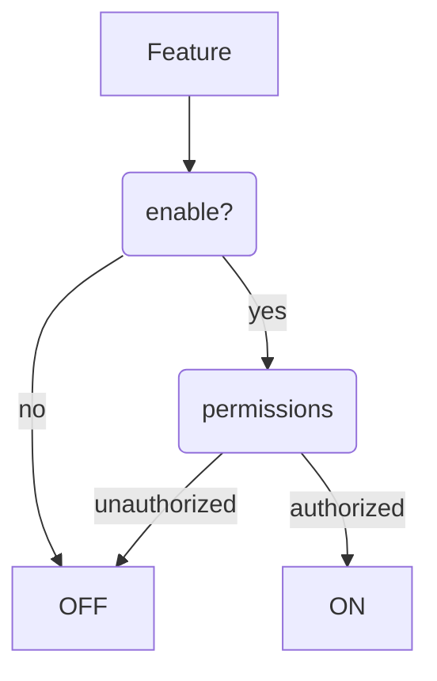

Let's try what markdown offers in context of Eleventy static site generator.

---

Markdown in Eleventy is parsed by [markdown-it](https://github.com/markdown-it/markdown-it). It can be extended by a number of [plugins](https://www.npmjs.com/search?q=keywords:markdown-it-plugin).

The first example is a table of content---it is a list that consists of headings on level 2. The plugin for this is [`markdown-it-table-of-contents`](https://www.npmjs.com/package/markdown-it-table-of-contents).

[[toc]]

## This is a heading h2

### This is a heading h3

#### This is a heading h4

##### This is a heading h5

## Text

Paragraphs in markdown have to be divided by a blank line.

This paragraph contains
multiple lines in source code,
because I like it more this way.
I've set it by a configuration option:

```
breaks: true
```

(Code block without specified language.)

### Text elements

**bold** _italic_ ~~strikethrough~~ `code`

> Quote

```js
const foo = 'more code'
```

(Code block with language specified as `js`.)

### Lists

- First
  - Alpha
  - Beta
- Second

1. First
   1. Alpha
   2. Beta
2. Second

### Automatic conversions

Links like example.com are automatically converted.

You can use two hyphens to produce an n-dash, e.g. 9--12. Or three hyphens---to create [m-dash](https://www.thepunctuationguide.com/em-dash.html).

"Quotation marks" and ellipsis is supported too...

## Extras

Extra markdown functionality is provided either by embedded or external `markdown-it` plugins.

### Tables

| Memory      | Latency (ns) |
| ----------- | ------------ |
| L1 cache    | 0.5          |
| L2 cache    | 7            |
| Main memory | 100          |

Source: [Latency Numbers Every Programmer Should Know](https://gist.github.com/jboner/2841832)

### Footnotes

You can specify references to footnotes by writing something like `[^markdown -capabilities]` [^markdown-capabilities]

[^markdown-capabilities]: [markdown capabilities](https://github.com/markdown-it/markdown-it#syntax-extensions)

### Mermaid



### Figures

### HTML example

```html {run}
<a href="google.com">google</a>

<style>
  code {
    font-size: 28px;
  }
</style>
```

```js {run}
window.klipse_settings
```
