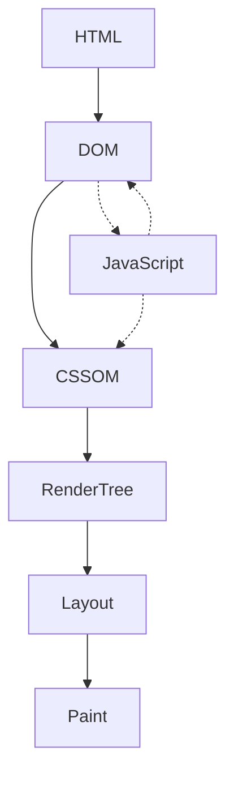

```html
<head>
  <link rel="stylesheet" href="style.css" />
  <script src="script.js"></script>
</head>
<body>
  <main></main>
</body>
```

1. Begin constructing the DOM by parsing HTML
2. Request CSS and JS resources
3. This is synchronous: wait for CSS resources
4. Parse CSS and construct CSSOM tree
5. Wait for JS to load, parse it
6. Execute JS
7. Merge DOM and CSSOM into the Render tree
8. Run Layout and Paint

## Critical rendering path


