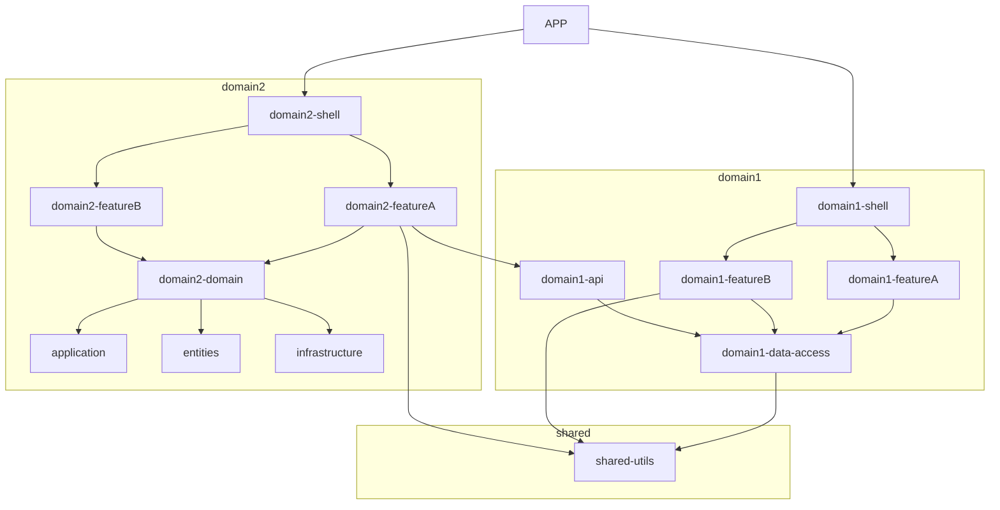

I came across several approaches to structuring a monorepo style projects. In this post I'm going to document several possibilities while using NX. Examples will be generated using NX cli and Angular cli.

---

```
ng new angular-workspace --createApplication="false"
ng generate application my-app
```

## Categories for libraries

- feature
- data-access
- ui
- util
- shell
- api
- domain
- assets



## Sources

- [Ebook from NX authors](https://go.nrwl.io/angular-enterprise-monorepo-patterns-new-book)
- [Article by Manfred Steyer](https://www.angulararchitects.io/aktuelles/sustainable-angular-architectures-2/)
- [Presentation by Manfred Steyer](https://www.youtube.com/watch?v=94HFD391zkE)
